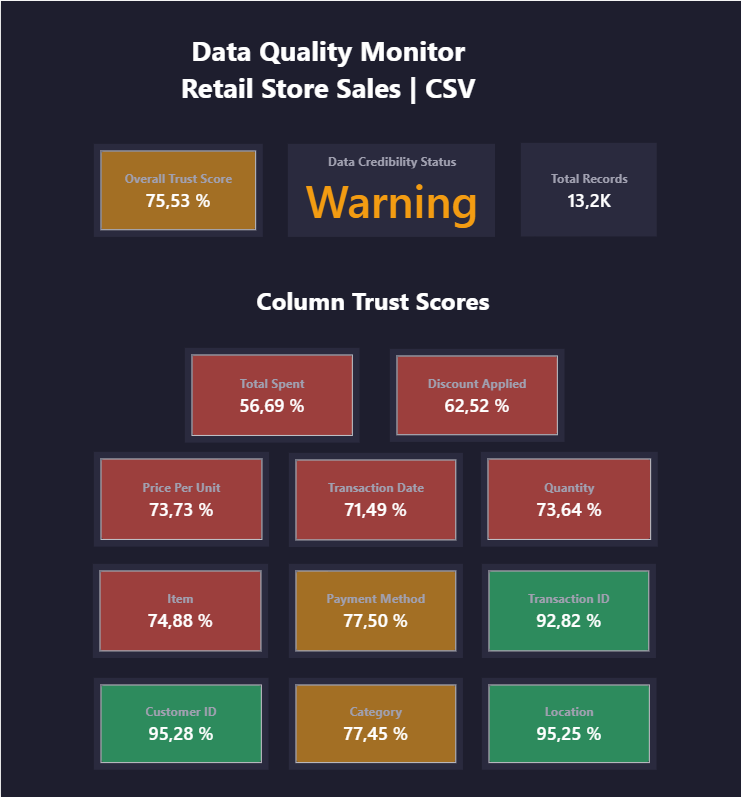

# Data Quality Monitor — Retail Store Sales


---

## Overview

A Power BI dashboard designed to monitor and score data quality at the source level, applied to a retail transactional dataset ingested from a CSV file.

Built from a **Product Owner Data perspective**, this project addresses a concrete business challenge: before building any ETL pipeline or reporting layer on top of raw data, you need to know how reliable that source actually is.

---

## Business Context

In a data lake architecture, raw data arrives from multiple heterogeneous sources — CSV files, APIs, databases, third-party exports. The quality of that data is rarely known upfront, and building transformations on top of unreliable data leads to compounding issues downstream: wrong KPIs, failed pipelines, and costly rework.

This dashboard answers three key Product Owner questions at the source evaluation stage:

**1. Is this source exploitable as-is, or does it require upstream remediation first?**
The Overall Trust Score gives an immediate, scored answer that can be shared with business stakeholders and data engineering teams without requiring a deep technical dive.

**2. Which columns carry the most quality risk, and what type of anomalies do they contain?**
Column-level scoring with tooltip drill-down surfaces anomalies by type — nulls, format issues, outliers, business rule violations — allowing prioritization of remediation efforts.

**3. How much ETL effort should we budget for this source?**
By quantifying the volume and nature of quality issues per column, the dashboard enables an informed conversation with data engineers about transformation complexity before any pipeline is built.

The goal is not to clean data reactively downstream. It is to assess quality at the source, identify where corrections should happen — ideally at the origin — and reduce ETL complexity and downstream impact proactively.

---

## Dataset

| Property | Value |
|---|---|
| Source | Retail Store Sales — CSV |
| Rows | 12,952 |
| Columns | 11 |
| Context | Retail transactional dataset with controlled data quality issues introduced across all column types to simulate real-world source conditions |

**Columns :** Transaction ID, Customer ID, Category, Item, Price Per Unit, Quantity, Total Spent, Payment Method, Location, Transaction Date, Discount Applied

---

## Data Quality Metrics by Column Type

### ID Column — Transaction ID
| Metric | Description |
|---|---|
| Null Values | Missing transaction identifiers |
| Duplicated Values | Rows sharing the same Transaction ID |

### String Columns — Customer ID, Category, Item, Payment Method, Location
| Metric | Description |
|---|---|
| Null Values | Missing categorical values |
| Incoherent Values Format | Values outside expected domain (e.g. "???", "UNKNOWN", "N/A", typos) |
| Value Distribution | Full list of distinct values with count — surfaces parasitic entries visually |

### Boolean Column — Discount Applied
| Metric | Description |
|---|---|
| Null Values | Missing boolean values |
| Incoherent Values Format | Values outside {True, False} — e.g. "yes", "Y", "1", "no" |

### Numeric Columns — Price Per Unit, Quantity, Total Spent
| Metric | Description |
|---|---|
| Null Values | Missing numeric values |
| Negative Values | Prices or quantities below zero |
| Incoherent Values Format | Non-numeric entries in numeric columns |
| Outlier Values (Z-Score > 3) | Values exceeding 3 standard deviations from the mean |
| Uncorrect Values (Total Spent only) | Rows where Total Spent ≠ Price Per Unit × Quantity |

### Date Column — Transaction Date
| Metric | Description |
|---|---|
| Null Values | Missing dates |
| Outlier Values (Future & Ancient) | Dates after today or before 2020 |
| Incoherent Values Format | Mixed date formats (DD/MM/YYYY, MM-DD-YYYY, etc.) |

---

## Scoring Model

Each column receives a weighted quality score between 0% and 100%. The scoring reflects **business impact**, not just technical frequency.

### Score formula

```
Column Score = Σ (1 - metric_rate) × metric_weight
Overall Score = Σ column_score × column_weight
```

### Column weights — Overall Trust Score

| Column | Weight | Rationale |
|---|---|---|
| Total Spent | 20% | Core financial KPI — highest business impact |
| Price Per Unit | 15% | Direct input to revenue calculation |
| Quantity | 15% | Direct input to revenue calculation |
| Transaction ID | 10% | Data integrity and traceability |
| Customer ID | 10% | Customer analytics foundation |
| Transaction Date | 10% | Time-based reporting dependency |
| Item | 10% | Product-level analysis |
| Payment Method | 5% | Secondary dimension |
| Location | 5% | Secondary dimension |

### Metric weights by column type

**Transaction ID** — Null Values 50% / Duplicated Values 50%

**String Columns & Discount Applied** — Null Values 50% / Incoherent Format 50%

**Price Per Unit & Quantity** — Null Values 30% / Negative Values 25% / Incoherent Format 25% / Outliers 20%

**Total Spent** — Uncorrect Values 40% / Null Values 25% / Negative Values 15% / Outliers 12% / Incoherent Format 8%

**Transaction Date** — Null Values 40% / Outliers 35% / Incoherent Format 25%

### Score thresholds

| Score | Status | Color |
|---|---|---|
| ≥ 90% | Trusted | 🟢 |
| 70% — 89% | Warning | 🟡 |
| < 70% | Critical | 🔴 |

---

## Dashboard Screenshots

### Home — Overall Trust Score & Column Trust Scores



### Tooltip — Total Spent (5 metrics including business rule violation)


### Tooltip — Transaction ID (duplicate detection)


### Tooltip — Discount Applied (boolean domain validation)


### Tooltip — Transaction Date (temporal outliers & format issues)


---

## Adaptability

This dashboard is designed as a reusable framework. The scoring model, column type logic, and DAX measures can be adapted to any transactional dataset by updating column names, metric weights, and business rules to match your context. Feel free to use it, fork it, and upgrade it as needed.

---

## How to Use

1. Download the `.pbit` file from this repository
2. Open it with Power BI Desktop
3. Connect your own dataset when prompted
4. Ensure your dataset contains the same column names listed above
5. Refresh — all metrics and scores recalculate automatically

---

## Author

**Abderrahmen Mokrani** — Senior Product Owner | Digital & Data Products

[LinkedIn](www.linkedin.com/in/a-mokrani) · PSPO II · PSM II · Power BI · DAX · SQL · Python

*This project is part of a GitHub portfolio demonstrating end-to-end data product ownership — from business need definition to technical implementation.*

---
---

# Data Quality Monitor — Retail Store Sales


---

## Vue d'ensemble

Dashboard Power BI conçu pour monitorer et scorer la qualité des données au niveau de la source, appliqué à un dataset transactionnel retail ingéré depuis un fichier CSV.

Construit avec une **approche Product Owner Data**, ce projet répond à un enjeu métier concret : avant de construire un pipeline ETL ou une couche de reporting sur de la donnée brute, il faut connaître la fiabilité réelle de cette source.

---

## Contexte métier

Dans une architecture datalake, la donnée brute arrive de sources hétérogènes — fichiers CSV, APIs, bases de données, exports tiers. La qualité de cette donnée est rarement connue à l'avance, et construire des transformations sur une source peu fiable génère des problèmes en cascade en aval : KPIs erronés, pipelines défaillants, et corrections coûteuses.

Ce dashboard répond à trois questions clés d'un Product Owner Data au stade de l'évaluation d'une source :

**1. Cette source est-elle exploitable telle quelle, ou nécessite-t-elle une correction en amont ?**
L'Overall Trust Score donne une réponse immédiate et scorée, partageble avec les parties prenantes métier et les équipes data engineering sans nécessiter une analyse technique approfondie.

**2. Quelles colonnes présentent le plus de risques qualité, et quel type d'anomalies contiennent-elles ?**
Le scoring par colonne avec drill-down en tooltip expose les anomalies par type — nulls, problèmes de format, outliers, violations de règles métier — permettant de prioriser les efforts de correction.

**3. Quel budget ETL faut-il prévoir pour cette source ?**
En quantifiant le volume et la nature des problèmes qualité par colonne, le dashboard permet une conversation éclairée avec les data engineers sur la complexité des transformations à prévoir, avant que le moindre pipeline soit construit.

L'objectif n'est pas de nettoyer la donnée de manière réactive en aval. C'est d'évaluer la qualité à la source, d'identifier où les corrections doivent avoir lieu — idéalement à l'origine — et de réduire proactivement la complexité ETL et l'impact en aval.

---

## Dataset

| Propriété | Valeur |
|---|---|
| Source | Retail Store Sales — CSV |
| Lignes | 12 952 |
| Colonnes | 11 |
| Contexte | Dataset transactionnel retail avec anomalies de qualité introduites de manière contrôlée sur tous les types de colonnes pour simuler des conditions réelles de source |

**Colonnes :** Transaction ID, Customer ID, Category, Item, Price Per Unit, Quantity, Total Spent, Payment Method, Location, Transaction Date, Discount Applied

---

## Métriques DQ par type de colonne

### Colonne ID — Transaction ID
| Métrique | Description |
|---|---|
| Valeurs Nulles | Identifiants de transaction manquants |
| Valeurs Dupliquées | Lignes partageant le même Transaction ID |

### Colonnes String — Customer ID, Category, Item, Payment Method, Location
| Métrique | Description |
|---|---|
| Valeurs Nulles | Valeurs catégorielles manquantes |
| Format Incohérent | Valeurs hors domaine attendu (ex. "???", "UNKNOWN", "N/A", typos) |
| Distribution des valeurs | Liste complète des valeurs distinctes avec count — expose visuellement les entrées parasites |

### Colonne Booléenne — Discount Applied
| Métrique | Description |
|---|---|
| Valeurs Nulles | Valeurs booléennes manquantes |
| Format Incohérent | Valeurs hors {True, False} — ex. "yes", "Y", "1", "no" |

### Colonnes Numériques — Price Per Unit, Quantity, Total Spent
| Métrique | Description |
|---|---|
| Valeurs Nulles | Valeurs numériques manquantes |
| Valeurs Négatives | Prix ou quantités inférieurs à zéro |
| Format Incohérent | Entrées non numériques dans des colonnes numériques |
| Outliers (Z-Score > 3) | Valeurs dépassant 3 écarts-types par rapport à la moyenne |
| Valeurs Incorrectes (Total Spent uniquement) | Lignes où Total Spent ≠ Price Per Unit × Quantity |

### Colonne Date — Transaction Date
| Métrique | Description |
|---|---|
| Valeurs Nulles | Dates manquantes |
| Outliers (Futures & Anciennes) | Dates postérieures à aujourd'hui ou antérieures à 2020 |
| Format Incohérent | Formats de date mixtes (JJ/MM/AAAA, MM-JJ-AAAA, etc.) |

---

## Modèle de scoring

Chaque colonne reçoit un score qualité pondéré entre 0% et 100%. Le scoring reflète l'**impact métier**, pas seulement la fréquence technique.

### Formule de calcul

```
Score colonne = Σ (1 - taux_métrique) × poids_métrique
Score global = Σ score_colonne × poids_colonne
```

### Poids des colonnes — Score global

| Colonne | Poids | Justification |
|---|---|---|
| Total Spent | 20% | KPI financier central — impact métier le plus élevé |
| Price Per Unit | 15% | Input direct au calcul du chiffre d'affaires |
| Quantity | 15% | Input direct au calcul du chiffre d'affaires |
| Transaction ID | 10% | Intégrité des données et traçabilité |
| Customer ID | 10% | Fondation de l'analytics client |
| Transaction Date | 10% | Dépendance des reportings temporels |
| Item | 10% | Analyse au niveau produit |
| Payment Method | 5% | Dimension secondaire |
| Location | 5% | Dimension secondaire |

### Poids des métriques par type de colonne

**Transaction ID** — Valeurs Nulles 50% / Valeurs Dupliquées 50%

**Colonnes String & Discount Applied** — Valeurs Nulles 50% / Format Incohérent 50%

**Price Per Unit & Quantity** — Valeurs Nulles 30% / Valeurs Négatives 25% / Format Incohérent 25% / Outliers 20%

**Total Spent** — Valeurs Incorrectes 40% / Valeurs Nulles 25% / Valeurs Négatives 15% / Outliers 12% / Format Incohérent 8%

**Transaction Date** — Valeurs Nulles 40% / Outliers 35% / Format Incohérent 25%

### Seuils de scoring

| Score | Statut | Couleur |
|---|---|---|
| ≥ 90% | Trusted | 🟢 |
| 70% — 89% | Warning | 🟡 |
| < 70% | Critical | 🔴 |

---

## Screenshots du dashboard

### Home — Score global & Scores par colonne


### Tooltip — Total Spent (5 métriques dont violation de règle métier)


### Tooltip — Transaction ID (détection de doublons)


### Tooltip — Discount Applied (validation du domaine booléen)


### Tooltip — Transaction Date (outliers temporels & problèmes de format)


---

## Adaptabilité

Ce dashboard est conçu comme un framework réutilisable. Le modèle de scoring, la logique par type de colonne et les mesures DAX peuvent être adaptés à n'importe quel dataset transactionnel en mettant à jour les noms de colonnes, les poids des métriques et les règles métier selon votre contexte. N'hésitez pas à l'utiliser, le forker et l'améliorer selon vos besoins.

---

## Comment utiliser

1. Télécharger le fichier `.pbit` depuis ce dépôt
2. L'ouvrir avec Power BI Desktop
3. Connecter votre propre dataset lorsque demandé
4. S'assurer que votre dataset contient les mêmes noms de colonnes listés ci-dessus
5. Actualiser — toutes les métriques et scores se recalculent automatiquement

---

## Auteur

**Abderrahmen Mokrani** — Senior Product Owner | Produits Digitaux & Data

[LinkedIn](www.linkedin.com/in/a-mokrani) · PSPO II · PSM II · Power BI · DAX · SQL · Python

*Ce projet fait partie d'un portfolio GitHub démontrant une maîtrise end-to-end de la gestion de produits data — de la définition du besoin métier à l'implémentation technique.*
